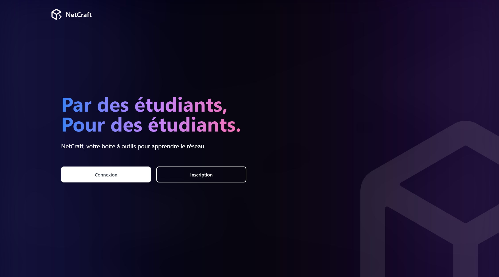
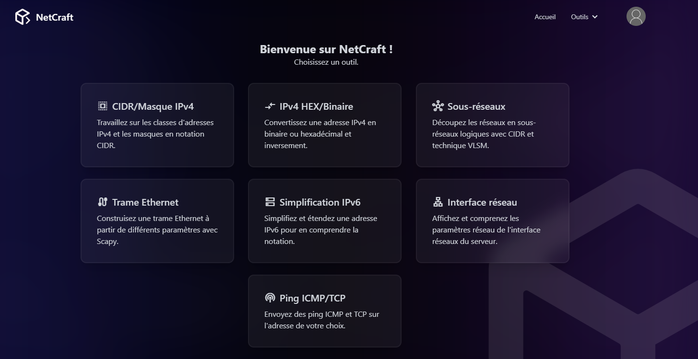
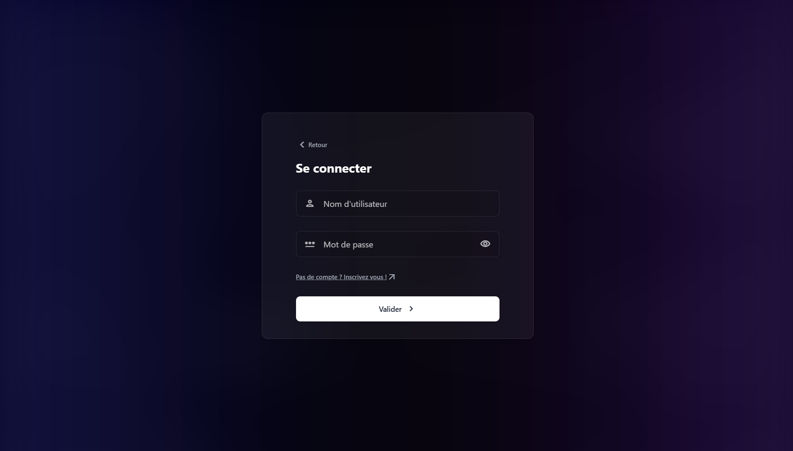

<a name="readme-top"></a>

<br />
<div align="center">


<h3 align="center">NetCraft</h3>

<p align="center">
Application de boîte à outils pédagogique réseaux, conçue et développée pour le projet de Saé5.01.
<br />
<a href="#introduction"><strong>Explorer la documentation »</strong></a>
<br />
</p>
<div align="center">

[![TS][typescript]][typescript-url]
[![HTML][html]][html-url]
[![CSS][css]][css-url]
[![JS][javascript]][javascript-url]
[![PYTHON][python]][python-url]
[![MYSQL][mysql]][mysql-url]
[![DOCKER][docker]][docker-url]
[![GITHUB][github]][github-url]
[![TAILWIND][tailwindcss]][tailwindcss-url]
[![DAISYUI][daisyui]][daisyui-url]

</div>
</div>

<details>
  <summary>Sommaire</summary>
  <ol>
    <li>
      <a href="#introduction">Introduction</a>
    </li>
    <li>
      <a href="#déploiement">Déploiement</a>
    </li>
    <li>
    <a href="#utilisation">Utilisation</a>
    </li>
    <li><a href="#contributeurs">Contributeurs</a></li>
  </ol>
</details>


## Introduction

NetCraft est une application éducative qui met a disposition une boite a outils pour s'aider dans la compréhension de la communication réseaux.


Netcraft regroupe plusieurs fonctionnalités principales. En voici une liste non exhaustive : 

- Système d'utilisateurs basique.
- Gestion des utilisateurs par un administrateur.
- Page de construction d'une trame ethernet.
- Conversion d'ipv4 en binaire et/ou hexadécimal.
- Séparation des classes de sous-réseaux.
- ...

<p align="right">(<a href="#readme-top">Retourner au début</a>)</p>


## Déploiement

Pour déployer le projet sur un serveur, voici les étapes a suivre : 

1. Avoir une distribution Debian sur un serveur qui a un accès a internet.
2. Installer Docker :

  ```bash
  # Add Docker's official GPG key:
  sudo apt-get update
  sudo apt-get install ca-certificates curl
  sudo install -m 0755 -d /etc/apt/keyrings
  sudo curl -fsSL https://download.docker.com/linux/debian/gpg -o /etc/apt/keyrings/docker.asc
  sudo chmod a+r /etc/apt/keyrings/docker.asc

  # Add the repository to Apt sources:
  echo \
    "deb [arch=$(dpkg --print-architecture) signed-by=/etc/apt/keyrings/docker.asc] https://download.docker.com/linux/debian \
    $(. /etc/os-release && echo "$VERSION_CODENAME") stable" | \
    sudo tee /etc/apt/sources.list.d/docker.list > /dev/null

  sudo apt-get update
  ```

  Puis :
  ```bash
  sudo apt-get install docker-ce docker-ce-cli containerd.io docker-buildx-plugin docker-compose-plugin
  ```


2. Extraire l'archive .tar.gz
```bash
mkdir NetCraft && tar -xzvf ./NetCraft.tar.gz -C ./NetCraft && cd NetCraft
```

3. Créer un fichier `.env` a la racine du projet qui contiendra les configurations sécurisées (exemple : le mot de passe de la base de donnée)

```
MYSQL_DATABASE=db 
MYSQL_USER=user 
MYSQL_PASSWORD=userpassword 
MYSQL_ROOT_PASSWORD=rootpassword 
SECRETKEY='alea@!ppii'
```

**Voici une commande qui permet de le faire automatiquement sur debian :**
```
printf \
	"MYSQL_DATABASE=db \n\
	MYSQL_USER=user \n\
	MYSQL_PASSWORD=userpassword \n\
	MYSQL_ROOT_PASSWORD=rootpassword \n\
  SECRETKEY='alea@!ppii'" \
	> .env
```

4. Lancer la construction et le lancement de l'image Docker

```bash
sudo docker compose up -d --build
```

5. NetCraft est maintenant disponible depuis : http://\<ip du serveur\>/

> Avertissement ! Si des erreurs lors de la connexion de l'utilisateur surviennents, il se peux que la base de donnée soit encore en cours de construction, attendez quelques secondes, parfois une minute est nécessaire !

## Utilisation

### Étudiant
1. **Inscription** :  
   - Accédez à la page <a href="http://localhost/signup">d'inscription</a>.  
   - Remplissez le formulaire avec vos informations (adresse mail, Nom d'utilisateur, mot de passe).
   > Avertissement : Le mot de passe doit contenir au minimum 6 charactères.
   - Cliquez sur le bouton **"S'inscrire"** pour créer votre compte.  
   - Une fois inscrit, vous serez redirigé vers la page de connexion.

2. **Connexion** :  
   - Entrez votre nom d'utilisateur et votre mot de passe.  
   - Cliquez sur **"Se connecter"** pour accéder à votre tableau de bord.

3. **Gestion de compte et accès aux modules** :  
   - Accédez à votre <a href="http://localhost/profil">profil</a> pour modifier votre mot de passe via le bouton en haut à droite de votre page.  
   - Cliquez sur **"Enregistrer"** pour sauvegarder les modifications.
   - Pour accéder aux cours, rendez vous sur la page home. Les différents modules sont accessibles.

### Admin

1. **Connexion** :  
   - Utilisez les identifiants par défaut pour vous connecter :  
     - Nom d'utilisateur : `admin`  
     - Mot de passe : `back2root$`  
  
2. **Gestion des utilisateurs** :  
   - Rendez vous dans votre pannel de gestion utilisateur via le bouton en haut à droite de votre écran
   - Visualisez la liste des étudiants inscrits.  
   - Sélectionnez un ou plusieurs comptes à supprimer.  
   - Cliquez sur **"Supprimer"** pour effectuer l'action.

### Outils

Tout les outils sont bien documentés et leurs utilisation est intuitive. Voici un aperçu.



Aperçu de la page de connexion


---


## Contributeurs

<table>
  <tbody>
    <tr>
      <td align="center" valign="top" width="14.28%"><a href="https://github.com/NoXeDev"><br /><sub><b>NoXeDev</b></sub></a></td>
      <td align="center" valign="top" width="14.28%"><a href="https://github.com/EwenDev"><br /><sub><b>EwenDev</b></sub></a></td>
      <td align="center" valign="top" width="14.28%"><a href="https://github.com/ComeRegnier"><br /><sub><b>ComeRegnier</b></sub></a></td>
      <td align="center" valign="top" width="14.28%"><a href="https://github.com/HighMax524"><br /><sub><b>HighMax524</b></sub></a></td>
      <td align="center" valign="top" width="14.28%"><a href="https://github.com/ldv500"><br /><sub><b>ldv500</b></sub></a></td>
      <td align="center" valign="top" width="14.28%"><a href="https://github.com/BluenessDev"><br /><sub><b>BluenessDev</b></sub></a></td>
    </tr>
  </tbody>
</table>


[typescript]: https://img.shields.io/badge/Typescript-0064ff?style=for-the-badge&logo=typescript&logoColor=white
[typescript-url]: https://www.typescriptlang.org/
[html]: https://img.shields.io/badge/HTML-E34F26?style=for-the-badge&logo=html5&logoColor=white
[html-url]: https://www.w3schools.com/html/
[css]: https://img.shields.io/badge/CSS-1572B6?style=for-the-badge&logo=css3&logoColor=white
[css-url]: https://www.w3schools.com/Css/
[javascript]: https://img.shields.io/badge/javascript-F7DF1E?style=for-the-badge&logo=javascript&logoColor=black
[javascript-url]: https://www.w3schools.com/Js/
[python]: https://img.shields.io/badge/python-3776AB?style=for-the-badge&logo=python&logoColor=white
[python-url]: https://www.python.org/
[mysql]: https://img.shields.io/badge/mysql-4479A1?style=for-the-badge&logo=mysql&logoColor=white
[mysql-url]: https://www.mysql.com/fr/
[docker]: https://img.shields.io/badge/docker-2496ED?style=for-the-badge&logo=docker&logoColor=white
[docker-url]: https://www.docker.com/
[github]: https://img.shields.io/badge/github-181717?style=for-the-badge&logo=github&logoColor=white
[github-url]: https://github.com/
[tailwindcss]: https://img.shields.io/badge/TailwindCss-0064ff?style=for-the-badge&logo=tailwindcss&logoColor=white
[tailwindcss-url]: https://tailwindcss.com/
[daisyui]: https://img.shields.io/badge/DaisyUI-1AD1A5?style=for-the-badge&logo=daisyui&logoColor=white
[daisyui-url]: https://daisyui.com/